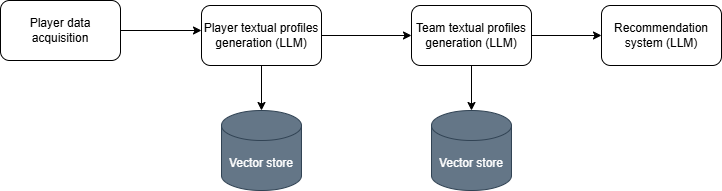
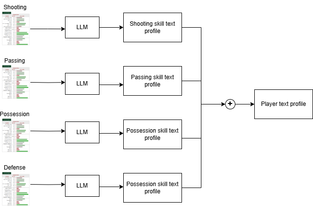
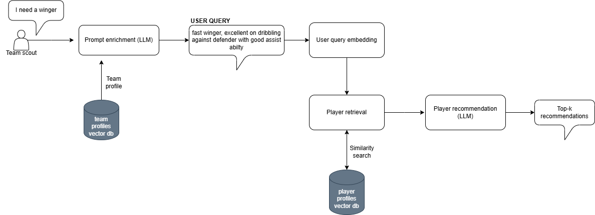

# Football Player Recommendation System

This project implements a recommendation system for football players based on both statistical data and natural language analysis using Large Language Models (LLMs).

## 🧠 System Overview

The pipeline is structured into three main stages:

---

## 1. 🔍 Data Acquisition & Prompt Generation

**Scripts**: `fbref_pipeline.py`, `transfermarkt_scraper.py`  
**Sources**: [fbref.com](https://fbref.com) and [transfermarkt.com](https://transfermarkt.com)

- `fbref_pipeline.py`:
  - Scrapes player and team data from FBref.
  - Generates structured prompts for each player and team based on their stats.
  
- `transfermarkt_scraper.py`:
  - Scrapes market-related data from Transfermarkt.

---

## 2. 📝 Profile Generation with LLM

**Script**: `description_generation.py`  
Uses the **Qwen2.5-7B-Instruct** quantized model to generate natural language profiles for players and teams based on the prompts.

---

## 3. 🎯 Recommendation System

**Script**: `recommendation.py`

- Initializes two **Chroma** vector databases: one for players, one for teams.
- Uses an LLM to perform recommendations by comparing profiles and suggesting compatible players according to team needs.

---

